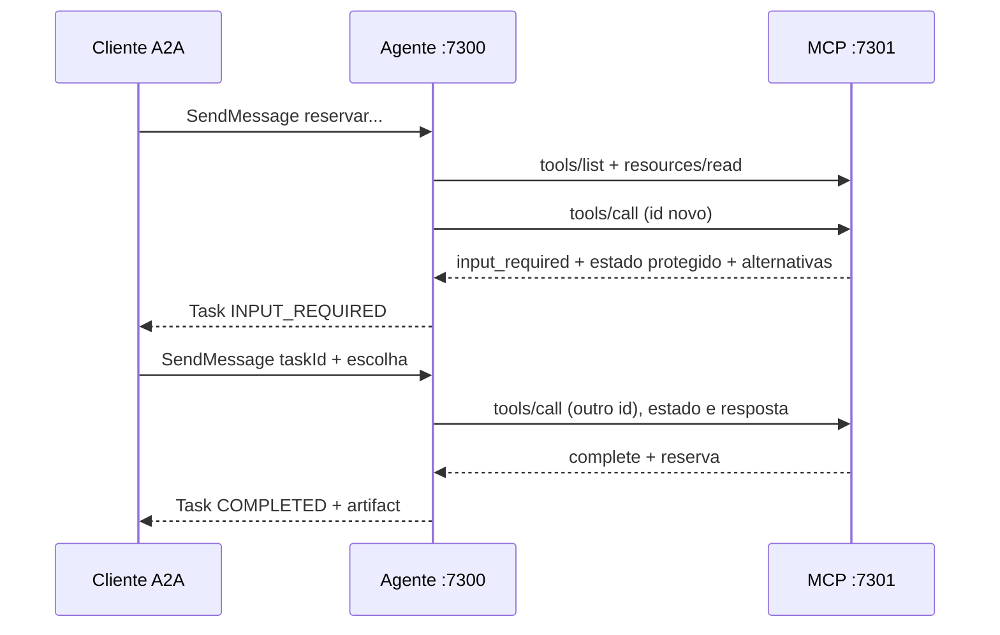

# MBA ESAI 2026 — A Ponte: agente A2A com MCP por dentro

Dois processos determinísticos para reservas da Hill Valley Tech. O servidor MCP aplica as regras de salas; o agente traduz o protocolo MCP em Tasks A2A. Não há LLM no caminho de execução.

**Validação: 36/36 verificações oficiais e 9 testes de integração passaram.** A entrega está na branch `feature/sdd-fase-308`, aguardando revisão/merge coordenado para `main` e envio na plataforma.

## Como rodar

Pré-requisitos: Python 3.11+ e [uv](https://docs.astral.sh/uv/getting-started/installation/). Os SDKs e dependências estão travados em `pyproject.toml` e `uv.lock`.

```bash
git clone https://github.com/renandlsantos/mba-esai-2026-ponte-a2a-mcp.git
cd mba-esai-2026-ponte-a2a-mcp
git switch feature/sdd-fase-308
uv sync --frozen
export REQUEST_STATE_SECRET="$(python3 -c 'import secrets; print(secrets.token_hex(32))')"
uv run python servidor-mcp/server.py
```

Esse primeiro terminal mantém o MCP em `http://127.0.0.1:7301/mcp`. A chave é hexadecimal com **32 bytes aleatórios**, não deve ser publicada. Para o teste de restart, interrompa e reinicie o MCP **no mesmo terminal**, preservando o valor de `REQUEST_STATE_SECRET`; gerar outra chave invalida estados anteriores.

Em um segundo terminal, na raiz do clone:

```bash
uv run python agente/server.py
```

O agente sobe em `http://127.0.0.1:7300/a2a`; o Agent Card fica em `/.well-known/agent-card.json`. O agente não precisa da chave do servidor.

Em um terceiro terminal, na raiz:

```bash
uv run python validador/validar.py --agente http://localhost:7300 --mcp http://localhost:7301
uv run pytest -q
```

O validador altera reservas na memória. **Reinicie ambos os processos antes de rodá-lo novamente**, restaurando os dados iniciais. Os testes automatizados sobem seus próprios processos em portas livres e os encerram; não matam processos externos.

Portas alternativas: configure `MCP_PORT` no servidor, `AGENT_PORT` e `MCP_URL=http://127.0.0.1:PORTA/mcp` no agente. `AGENT_URL` altera a URL anunciada no card quando necessário. Passe as mesmas URLs ao validador.

### Exercício manual da pausa

Use um MCP recém-iniciado para obter o estado inicial. Abra `exemplos/wire/08-a2a-send-message.json` e envie somente seu objeto `request.body`:

```bash
python3 -c 'import json; print(json.dumps(json.load(open("exemplos/wire/08-a2a-send-message.json"))["request"]["body"]))' \
  | curl -sS http://localhost:7300/a2a -H 'Content-Type: application/json' -d @-
```

A resposta contém `result.task.id` e `TASK_STATE_INPUT_REQUIRED`, com `alternativas: sala-fusca, sala-mirante`. Envie a mensagem `escolha=sala-mirante` seguindo o formato de `10-a2a-send-message-continuacao.json`, substituindo `taskId` pelo ID retornado. Consulte a mesma Task com o corpo de `09-a2a-get-task-input-required.json` adaptado. Ela terá `TASK_STATE_COMPLETED` e artifact `reserva`.

Para recusar, abra outra Task conflitante e responda `escolha=recusar`. Uma escolha fora das alternativas mantém a pausa. Os exemplos são contratos históricos; IDs e tokens neles não são reutilizáveis contra uma nova execução.

## Onde a ponte acontece

Em [`agente/server.py`](agente/server.py), `Bridge.apply` recebe `resultType=input_required`, guarda `requestState`, chave da pergunta e alternativas **somente no registro privado da Task**, e chama `pause` para produzir `TASK_STATE_INPUT_REQUIRED`. Na continuação, `Bridge.send` monta `inputResponses` com a mesma chave, ecoa o estado sem interpretá-lo e chama `MCPHost.request`; esse método cria um UUID novo para cada request JSON-RPC. `Bridge.apply` então traduz a reserva em artifact, a recusa em `CANCELED` ou o erro da tool em `FAILED`.



## Decisões técnicas

- **SDK oficial MCP 2.2.0**, revisão `2026-07-28`, `MCPServer` em Streamable HTTP stateless, resposta JSON. O SDK implementa transporte, schemas, erros e MRTR. O wrapper `RequestGuard` exige metadados por request e registra método/id/traceparent, sem reimplementar o protocolo.
- **AEAD nativo**: `RequestStateSecurity(keys=[...], ttl=600)` usa AES-256-GCM com derivação HKDF. O estado expira em **dez minutos**, é vinculado a método, alvo e argumentos, e a chave vem exclusivamente do ambiente. Não há chave de fallback/efêmera. Estado alterado/expirado e argumentos diferentes são rejeitados com `-32602`.
- **Estado autossuficiente**: o payload selado carrega argumentos e alternativas. O servidor não mantém contexto de elicitation em memória. Com a mesma chave, o retry funciona após restart. Reservas voltam ao JSON inicial no restart, conforme escopo.
- **Host MCP explícito**: HTTP JSON permite receber o `input_required` cru sem callback que resolva a pergunta automaticamente. Descobre `tools/list` em runtime, seleciona a tool necessária, lê a versão de `politica://uso` e inclui metadados/headers em toda chamada.
- **Tasks em memória por UUID**, com lock por Task e objeto público separado do estado privado. `GetTask` pode observar o estado atual enquanto uma chamada MCP está pendente. Estados terminais não voltam a executar. Restart do agente perde Tasks, o que não é exigido persistir pelo desafio.
- **Trace context**: o `traceparent` da abertura é guardado com a Task e propagado em todas as suas chamadas, inclusive retry. Logs contêm somente método, id e traceparent; nunca chave ou requestState.
- **Domínio mínimo**: cinco salas, reservas iniciais e política lidos dos arquivos fornecidos. Sem ORM/banco/LLM. As regras de horário, capacidade e conflito existem apenas no processo MCP.

O SDK está alinhado ao contrato e não exigiu contorno de MRTR. A ferramenta Endor `dependency-reviewer/package-risk` estava indisponível no ambiente; não afirmamos auditoria de segurança das dependências.

## Processo SDD e materiais

[Spec Kit oficial](https://github.com/github/spec-kit) 1.0.8: [constituição](.specify/memory/constitution.md) → [especificação](specs/001-ponte-a2a-mcp/spec.md) → [plano](specs/001-ponte-a2a-mcp/plan.md) → [tarefas](specs/001-ponte-a2a-mcp/tasks.md) → implementação → convergência.

Consultadas as aulas privadas 18588 (Tool Calling vs MCP vs A2A) e 18624 (MCP + A2A: Design Patterns): a separação capacidade/tarefa guiou as responsabilidades. Nenhuma transcrição foi copiada ao repositório público. O enunciado e os exemplos são a autoridade para as versões exigidas.

Fontes primárias: [MCP Python SDK](https://github.com/modelcontextprotocol/python-sdk), [MCP 2026-07-28](https://modelcontextprotocol.io/specification/2026-07-28/basic), [A2A](https://a2a-protocol.org/latest/specification/).

## Saída do validador

Execução real em processos novos, portas isoladas equivalentes às padrão. [Arquivo integral](docs/validador-36.txt), [requests MCP sem payloads](docs/mcp-requests.jsonl), [validação complementar](docs/validacao.md).

```text
trace-id desta execucao: 68908fd8ab401dcc05ad7e7b9763032c
procure esse valor no stderr do servidor MCP para conferir a propagacao do traceparent.

PASS 01 tools/list traz as tres tools
PASS 02 toda tool tem inputSchema de objeto
PASS 03 listar_salas devolve structuredContent e o mesmo JSON em texto
PASS 04 _meta sem protocolVersion devolve -32602 e HTTP 400
PASS 05 _meta sem clientCapabilities devolve -32602 e HTTP 400
PASS 06 tool inexistente e recusada, por -32602 ou por isError
PASS 07 resources/read de politica://uso devolve a politica
PASS 08 resources/read de URI inexistente devolve -32602
PASS 09 sala inexistente devolve isError com a mensagem exata
PASS 10 fora da janela devolve isError com a mensagem exata
PASS 11 duracao acima de 2h devolve isError com a mensagem exata
PASS 12 intervalo invertido devolve isError com a mensagem exata
PASS 13 conflito devolve input_required com inputRequests e requestState
PASS 14 a elicitation e form mode e oferece as alternativas na ordem certa
PASS 15 conflito sem a capability elicitation devolve -32021 e HTTP 400
PASS 16 retry com inputResponses e requestState conclui a reserva
PASS 17 requestState adulterado e rejeitado com -32602
PASS 18 argumentos adulterados no retry nao tomam efeito
PASS 19 recusa conclui sem reservar e sem isError
PASS 20 conflito sem alternativa possivel devolve isError com a mensagem exata

PASS 21 agent card responde 200 no well-known com JSON
PASS 22 o card declara a interface JSON-RPC com url e versao 1.0
PASS 23 o card declara a skill reservar-sala
PASS 24 SendMessage com sala livre conclui a Task
PASS 25 o artifact chama reserva e traz a versao da politica
PASS 26 GetTask devolve id, contextId e estado corrente
PASS 27 SendMessage com sala ocupada pausa a Task
PASS 28 a Task pausada lista as alternativas na ordem certa
PASS 29 escolha fora do enum mantem a Task pausada
PASS 30 a continuacao conclui a Task na sala escolhida
PASS 31 SendMessage em Task terminal e recusado
PASS 32 a recusa termina a Task em CANCELED
PASS 33 duas Tasks pausadas ao mesmo tempo concluem cada uma com a sua reserva
PASS 34 nenhuma resposta A2A carrega o requestState
PASS 35 sala inexistente termina a Task em FAILED com a mensagem da tool
PASS 36 o agente e deterministico: o mesmo pedido produz a mesma pausa

resumo: 36 passaram, 0 falharam, de 36 verificacoes
```
